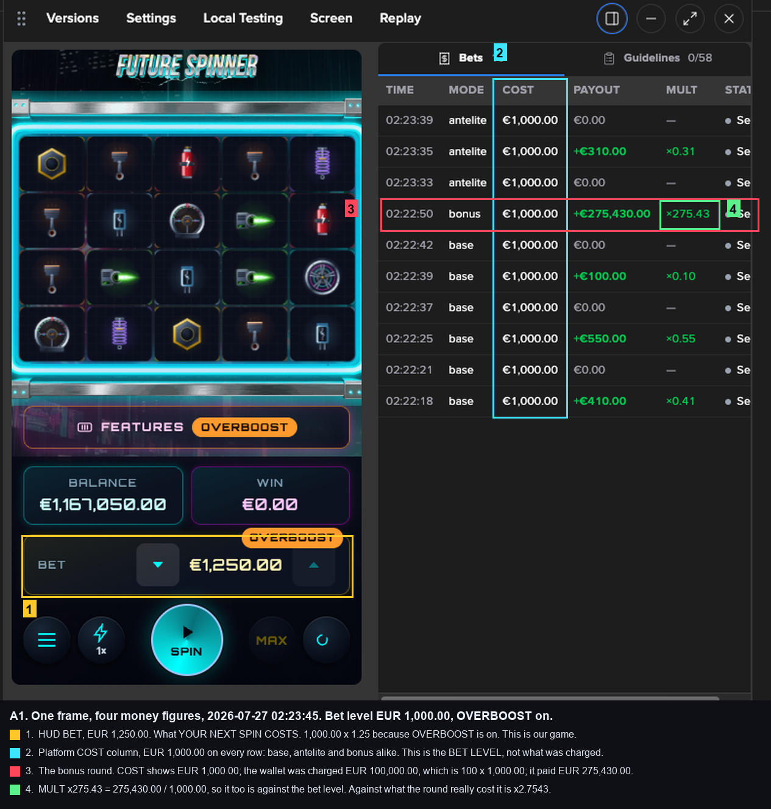
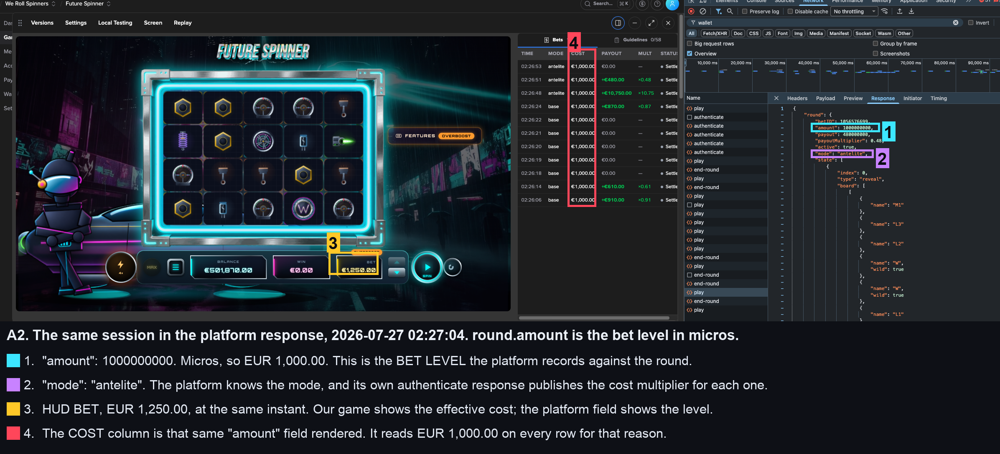
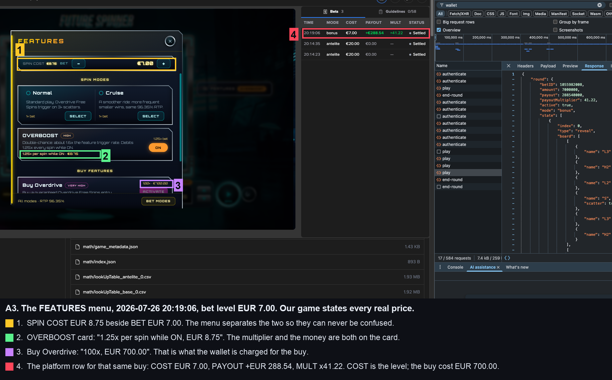
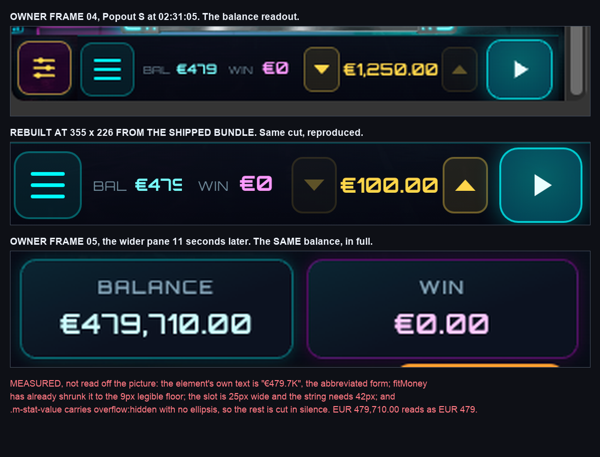

# Where every money figure comes from, and why the platform's COST column looks wrong

For the owner. Written 2026-07-27 by `track/screenshot-analyst`, from your own
captures. One page. Every figure below is from a frame you took, and every frame
is named so you can open it yourself.

## The short answer

**Our game is showing your bet correctly. The platform's Bets page is showing a
different number on purpose, and it does that for every studio on Stake Engine,
in every mode.**

There is exactly one real display defect in the whole intake, and it is not the
bet size. It is the balance readout in the smallest popout, and it is written up
at the end.

## Three numbers that all look like "the bet", and are not the same thing

| What you see | Where | What it actually is |
| --- | --- | --- |
| **BET EUR 1,250.00** | our HUD, the gold plate | What YOUR NEXT SPIN COSTS. The bet level times the mode multiplier |
| **COST EUR 1,000.00** | the platform's Bets page | The BET LEVEL. Never the multiplier, never the charge |
| **EUR 1,000.00** | `round.amount` in the platform response | The same bet level, in micros, and it is what feeds that COST column |

They disagree because they are answers to three different questions, not because
any of them is wrong.

That is your frame from 02:23:45 this morning. Bet level EUR 1,000.00, OVERBOOST
on, so the spin costs EUR 1,250.00 and our HUD says so. The platform's COST
column says EUR 1,000.00 on every single row in the panel, including the bonus
buy that cost you EUR 100,000.00.

## Why the platform's COST column reads the bet level, for every studio

Because the platform stores the bet **level** on the round, and renders that
field in the column. Here it is in the response itself, from your 02:27:04 frame:

    "amount": 1000000000,          <- micros, so EUR 1,000.00, the bet LEVEL
    "mode": "antelite",            <- the platform knows the mode
    "payoutMultiplier": 0.48       <- payout divided by that same level

The platform is not confused about the cost. Its own authenticate response, in
`reports/screens/live-shapes-2026-07-26/04_authenticate_response_jurisdiction_TOP_LEVEL.png`,
publishes a cost multiplier for each mode:

    "mode": "bonus",  "costMultiplier": 100
    "mode": "super",  "costMultiplier": 400

So the platform holds **level** and **multiplier** as two separate fields, and
the Bets page column shows the first one. Its own bet detail drawer carries
`Cost (USD)` and `Cost multiplier` as separate fields, which is where the
distinction is meant to be read. That is a platform convention, applied the same
way to every game on it, and it is not something our frontend renders or can
change.

The same applies to the MULT column. `x275.43` on your bonus row is
275,430.00 divided by 1,000.00, the level. Against what the round actually cost
you it is x2.7543.

## Our own menu states every real price, so nothing has to be inferred

From your 20:19:06 session at a EUR 7.00 bet level: SPIN COST EUR 8.75 sits
beside BET EUR 7.00 in the same bar, the OVERBOOST card says "1.25x per spin
while ON, EUR 8.75", and Buy Overdrive says "100x, EUR 700.00". The player is
never asked to work out the multiplier.

## The two worked examples, from your own sessions

Both come from the Bets rows and the BALANCE readout in a single frame, so
nothing is carried in from outside the picture. The opening balance is not in
either capture, so it is **solved for**, twice, once under each reading. That is
what makes this a test rather than a restatement of what we already believed.

**OVERBOOST and a bonus buy, 02:22:18 to 02:23:45, your frame 01.** Ten rounds:
six `base`, three `antelite`, one `bonus`, all at a EUR 1,000.00 level.

    true debits   6 x 1,000.00  +  3 x 1,250.00  +  1 x 100,000.00  =  109,750.00
    credits                                       410 + 550 + 100 + 275,430 + 310  =  276,800.00
    net                                                                            =  +167,050.00
    closing BALANCE in the frame                                                    = 1,167,050.00
    so the session opened at                                                        = 1,000,000.00

Exactly one million euro, to the cent. If the COST column were what you had
really been charged, the same ten rows would need an opening balance of
EUR 900,250.00, which is not a figure the platform hands out.

**OVERBOOST alone, 02:26:06 to 02:27:04, your frame 02.** Eleven rounds, eight
`base` and three `antelite` at the same level.

    true debits   8 x 1,000.00  +  3 x 1,250.00   =  11,750.00
    credits       910 + 610 + 870 + 10,750 + 480  =  13,620.00
    net                                            =  +1,870.00
    closing BALANCE in the frame                   =  501,870.00
    so the session opened at                       =  500,000.00

Exactly five hundred thousand. Under the COST column reading it would be
EUR 499,250.00.

**And once more from the evening before**, your 20:14 to 20:22 session at EUR 20.00
then EUR 7.00: five `antelite` and one `bonus` close at EUR 512.29 against an
opening of exactly EUR 1,000.00, and against EUR 291.75 under the other reading.

Three sessions, two days, three bet levels. Every one lands on a round platform
figure under the true costs and on an arbitrary figure under the COST column.
The wallet is charging 1.25x for OVERBOOST and 100x for the buy, and our HUD is
showing you exactly that.

The full working, generated rather than typed, is in
`reports/qa/live_stats/2026-07-27_money_timeline.md`.

## The one thing that IS wrong, and it is not the bet

In the smallest popout your BALANCE reads **EUR 479** when you hold
**EUR 479,710.00**.

It is not a rounding rule and it is not the bet size. The readout is meant to
abbreviate to `EUR 479.7K` when the full figure will not fit, and it does produce
that string. The string then does not fit either, and the box cuts it without an
ellipsis, so what survives is a number that looks complete and understates your
balance a thousandfold.

Measured on the shipped bundle, rebuilt at the same size: the element's own text
is `EUR 479.7K`, already shrunk to the 9px legibility floor, needing 42px in a
25px slot. Your frame 05 eleven seconds later, in a slightly wider pane, shows
the same balance as `EUR 479,710.00` in full. The same fault is in your
20:22 capture from the night before, where `EUR 512.29` renders as `EUR 512.2`,
which is the more dangerous version because nothing about it looks cut.

It is logged as `SA-021`, severity HIGH, for the integrator to promote. It is
player money display, so under the project's own rule this track raises it and
does not rule on the fix.

## If you want the platform's column to stop reading as a discount

It is the platform's, not ours, so the only routes are to raise it with Stake
Engine before submission or to note it in the submission dossier so a reviewer
reading the Bets page alone does not underestimate spend on every non unit mode.
That is a decision for you and Fable; it is logged at `SA-002` and `SA-007` and
has been waiting on a ruling since 2026-07-26.
